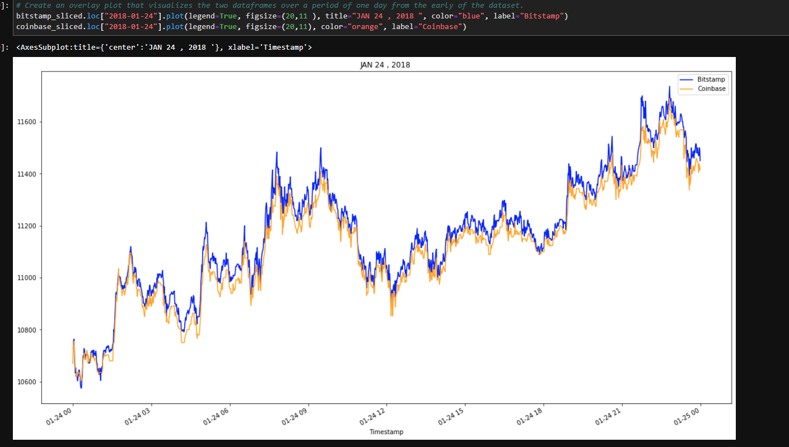

## BTC ARBITRAGE  🌍🏁
   

*The Bitcoin markets from 2015 and Present attracts plenty of attention from arbitrageurs. The more arbitrageurs that play in the market, the less profits remain to go around. When more people buy in the cheaper exchange, the price goes up. By contrast, more people selling in the more expensive exchange drives the price down. The potential for arbitrage profits attracts new traders to the market, which eventually causes these profits to shrink and, in some cases, disappear.

>👨🏿‍⚖️[click here  to](pics/https://captainaltcoin.com/bitcoin-arbitrage/)  **LEARN MORE** *about   `Arbitrage ` and the effects it had on BTC and the Cpryto Market today*

## ARBITRAGE 
---
STEP 1- Get data from lower price exchange and hower price exchanage 
>👨🏿‍⚖️`Data` need to be clearn ready to **Measure**

*Measure the Arbitrage Spread* - `GET SUMMARY`
    

>👨🏿‍⚖️This is  `bitstamp/coinbase` **closing price**  from JAN 24, 2018 
  
  * Bitstamp = 11700 Coinbase = 11564 

