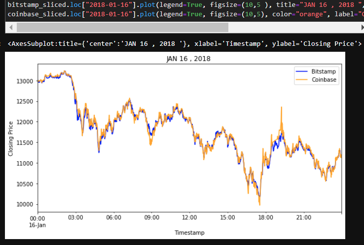
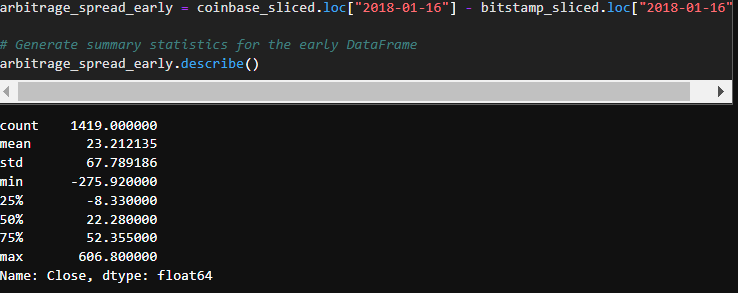
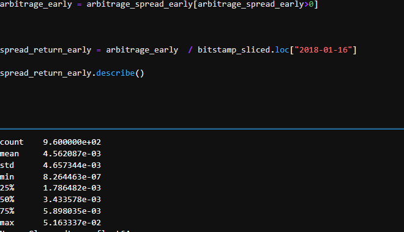
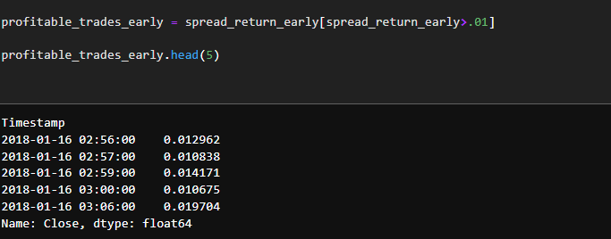
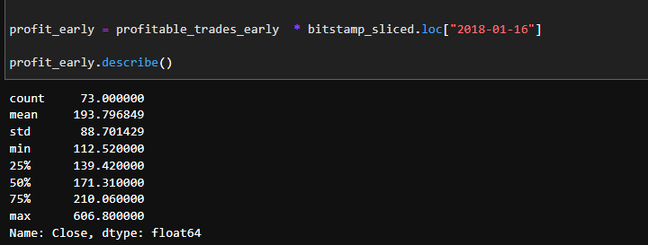
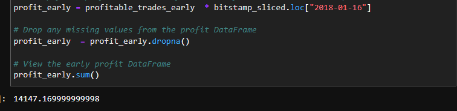
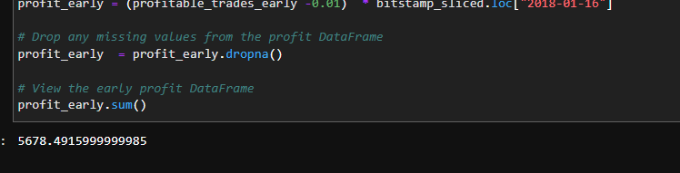
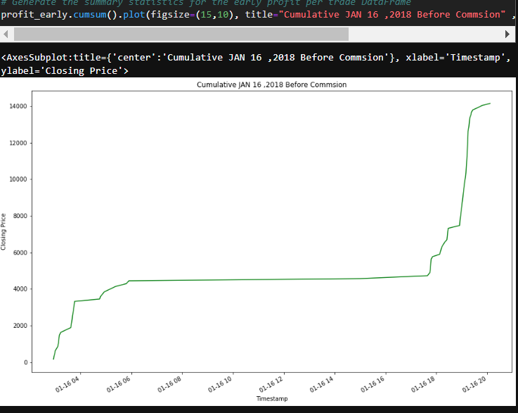
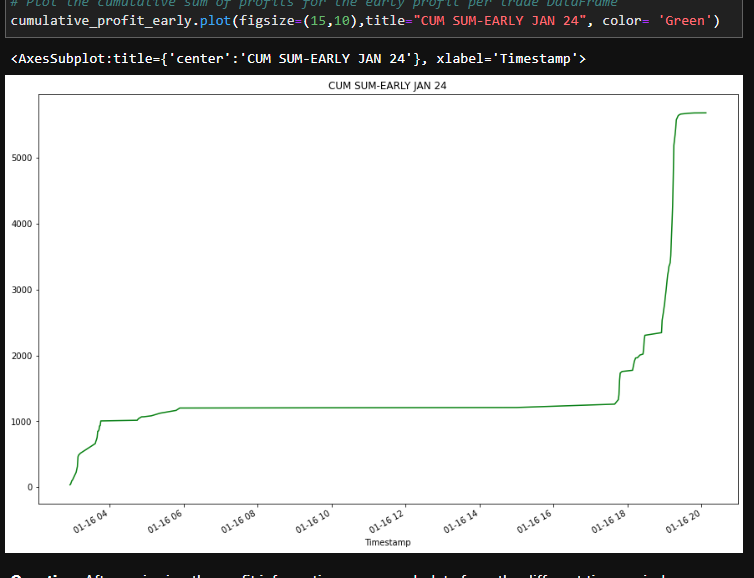

## BTC ARBITRAGE  🌍🏁
 

The Bitcoin markets from 2015 and Present attracts plenty of attention from arbitrageurs. The more arbitrageurs that play in the market, the less profits remain to go around. When more people buy in the cheaper exchange, the price goes up. By contrast, more people selling in the more expensive exchange drives the price down. The potential for arbitrage profits attracts new traders to the market, which eventually causes these profits to shrink and, in some cases, disappear.

>👨🏿‍⚖️[click here  to](https://captainaltcoin.com/bitcoin-arbitrage/)  **LEARN MORE** *about   `Arbitrage ` and the effects it had on BTC and the Cpryto Market today*

## ARBITRAGE 
---

STEP 1 - Get  `lower` price exchange and `higher` price exchanage 

>👨🏿‍⚖️`Data` need to be clean ready to **Measure**

*Measure the Arbitrage Spread* - `GET SUMMARY`
    

>👨🏿‍⚖️This is  `bitstamp/coinbase` **closing price**  from JAN 16, 2018 
  
  * [Spread Amount](https://www.investopedia.com/terms/s/spread.asp#:~:text=In%20finance%2C%20a%20spread%20refers%20to%20the%20difference,%28from%20sellers%29%20prices%20of%20a%20security%20or%20asset) Coinbase - Bitstamp    
  >👨🏿‍⚖️`Spread Amount` I want to know percentage amount and want a  `Summary` of that
    

Step 2 - Calculate Trading Cost

*Before Comission*
 

*Potential Profits*
   
   * 👨🏿‍⚖️ Are trades that are over  0.1
`LETS SEE` **Profit per trade** down to day, hour, or even min 
   

   *Profits*
  👨🏿‍⚖️ WE need to **convert** percentage back into dollars and get a `SUMMARY` of the trade that where over 0.1  
  
 
 >👨🏿‍⚖️this is a summary of  trades that is `PROFIT`

STEP 3 - CALCULATE 
  
 
 >👨🏿‍⚖️Commission = Transaction fee 0.5% for buying 0.5 % for selling 
   *  👨🏿‍⚖️$14,147.16 in dollars = profit before commission

   Profit after `Commisson `
   
   * >👨🏿‍⚖️`After` commisson Take home price would = $5,678.49 **Before** commisson or if there was NO commisson take home price = $14,147.16 
  Profit Before `Commisson `
  
   
  
  *We can visual see profits accumulated at a consistent pace BEFORE COMMISSION*  
  
   
   
   *We can visual see profits accumulated at a consistent pace AFTER COMMISSION* 
   

   👨🏿‍⚖️ Trading Profit is significantly different and can be not worth it when commsion is applied this why `ARBITRAGE` is better for NEW MARKETS because it more violatile which lead to higher spread. 
 
 ## REQUIREMENTS
 *Using up to date as of 4/18/22*
 
 PYTHON 3.10 [click here](https://www.python.org/downloads/)

PANDAS [click here](https://pandas.pydata.org/pandas-docs/stable/getting_started/install.html)

PATHLIBS [click here](https://pypi.org/project/pathlib/)

JUPYTER LAB [click here](https://jupyterlab.readthedocs.io/en/stable/getting_started/installation.html)

 
 
 ## INSTALLATION

>👨🏿‍⚖️install  zip downloand or clone 
   
   [click here](https://github.com/brprod8/Abitrage.git) for zip file

   [Click here](https://github.com/brprod8/Abitrage) to visit  GITHUB for CLONE
## LICENSE
**Open to Experiment**

BY:ROBERT SMITH

 CREDIT: UC BERKELEY

EMAIL - Brprod8@gmail.com for Colloboration 
 ## ARBITRAGE AND FINTECH
  
  Fintech has had a tremendous impact on arbitrage over the last several years. Fintech investment and trading firms have allocated millions of dollars to programs that scour the world’s exchanges looking for price dislocations across assets. As soon as these firms discover arbitrage opportunities, they have the trading technology in place to carry out both the buy and the sell in a matter of microseconds—at lightning speed.

  When the Bitcoin craze began in the mid-2010s, enthusiasts built bots on their home computers to exploit pricing inconsistencies like those you analyzed in this lesson. As the price of Bitcoin increased and the potential for profits grew, so did corporate attention to the Bitcoin markets. A recent academic study found that during the peak of the arbitrage expansion for Bitcoin, profits for arbitrageurs reached $75 million per day.
  These levels of profit eventually attracted interest from large financial firms. Small bots evolved into cutting-edge algorithms that could take advantage of pricing disparities in milliseconds and at a scale that measured in the millions of dollars. As a result, sizable arbitrage opportunities in Bitcoin were gone by 2019.

The Bitcoin arbitrage algorithms were just the tip of the iceberg. Today, fintech trading firms have developed programs that scour markets worldwide—in cryptocurrency and elsewhere—searching for any sizable arbitrage situations. The programs then immediately carry them out. Arbitrage opportunities exist in foreign exchange (currency) markets, derivative markets like options and futures, stocks, and bonds. These types of profits aren’t usually as extreme as those once observed for Bitcoin, but they do still arise.
Because of the scale of technological involvement, when arbitrage opportunities do arise, algorithms almost immediately trade them out of existence. The algorithms record the profits and continue searching for the next trade. It’s a dynamic and competitive aspect of the fintech industry, which has received significant attention. This is why when doing arbitrage yourself, you need to rely on writing code that quickly and automatically performs trades.

>👨🏿‍⚖️With the help of Python and its libraries can make performing quick automation made easy

