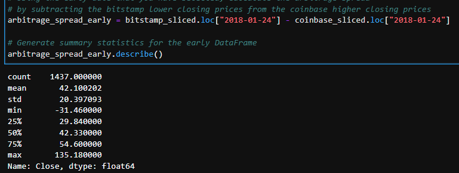

## BTC ARBITRAGE  🌍🏁
 

The Bitcoin markets from 2015 and Present attracts plenty of attention from arbitrageurs. The more arbitrageurs that play in the market, the less profits remain to go around. When more people buy in the cheaper exchange, the price goes up. By contrast, more people selling in the more expensive exchange drives the price down. The potential for arbitrage profits attracts new traders to the market, which eventually causes these profits to shrink and, in some cases, disappear.

>👨🏿‍⚖️[click here  to](https://captainaltcoin.com/bitcoin-arbitrage/)  **LEARN MORE** *about   `Arbitrage ` and the effects it had on BTC and the Cpryto Market today*

## ARBITRAGE 
---

STEP 1 - Get data from lower price exchange and hower price exchanage 
>👨🏿‍⚖️`Data` need to be clean ready to **Measure**

*Measure the Arbitrage Spread* - `GET SUMMARY`
    

>👨🏿‍⚖️This is  `bitstamp/coinbase` **closing price**  from JAN 16, 2018 
  
  * [Spread Amount](https://www.investopedia.com/terms/s/spread.asp#:~:text=In%20finance%2C%20a%20spread%20refers%20to%20the%20difference,%28from%20sellers%29%20prices%20of%20a%20security%20or%20asset) Coinbase - Bitstamp    
  >👨🏿‍⚖️`Spread Amount` I want to know percentage amount and want a  `Summary` of that

Step 2 - Calculate Trading Cost

*Before Comission*
 

*Potential Profits*
   
   * 👨🏿‍⚖️ Are trades that are over  0.1
`LETS SEE` **Profit per trade** down to day, hour, or even min 
   

   *Profits*
  👨🏿‍⚖️ WE need to **convert** percentage back into dollars and get a `SUMMARY` of the trade that where over 0.1  
  
 
 >👨🏿‍⚖️this is a summary of  trades that is `PROFIT`

STEP 3 - CALCULATE 
  
 After Commission
 
 >👨🏿‍⚖️Commission = Transaction fee 0.5% for buying 0.5 % for selling 
   *  👨🏿‍⚖️$14,147.16 in dollars = profit before commission

   Profit after `Commisson `
   
   * >👨🏿‍⚖️`After` commisson Take home price would = $5,678.49 **Before** commisson or if there was NO commisson take home price = $14,147.16 
  Profit Before `Commisson `
  
   
  
  *We can visual see profits accumulated at a consistent pace BEFORE COMMISSION*  
  
   
   
   *We can visual see profits accumulated at a consistent pace AFTER COMMISSION* 
   

   👨🏿‍⚖️ Trading Profit is significantly different and can be not worth it when commsion is applied this why `ARBITRAGE` is better for NEW MARKETS because it more violatile which lead to higher spread. 